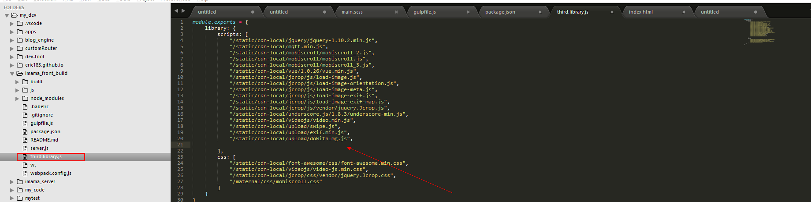

#imama_front_build

<!-- 1、clone到imama_server同级下

2、npm install

3、npm run dev 开发模式 -->

##2016-11-25更新
	

	1、clone到imama_server同级

	2、npm install

###妈咪home:

	

	增加production和development环境

	在npm scripts已经做好区分

		npm run home (production)

		npm run source (development)

	

	以后三方script和css可以写在third.library.js这个module了，顺序塞进去就可以， npm run third就会打包到项目里的all.min.js里

	  
